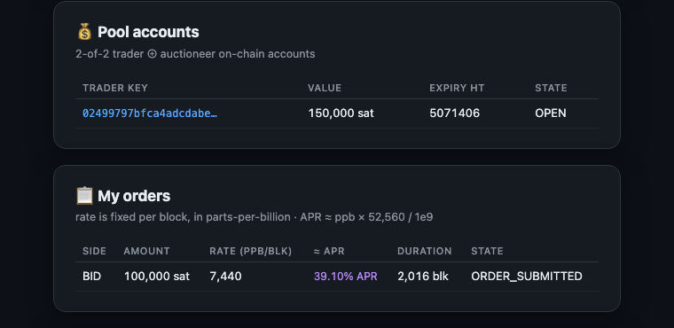

# Pool Setup & First Operations (testnet3)

> **Purpose:** Log of standing up `poold` against the public test auctioneer and
> executing real Pool operations: reading the live auction, opening a 2-of-2
> account on-chain, and working with orders. Everything below is real output
> from `test.pool.lightning.finance:12010` and verifiable on
> [mempool.space/testnet](https://mempool.space/testnet).
>
> Part of the [Environment Setup](../README.md) section. Concepts behind all of
> this: [04 — Pool: Auctions & Lease Pricing](../04-pool-auctions-lease-pricing.md).

---

## 0. Why testnet, not signet

Pool's hosted auctioneer does not serve signet — only mainnet
(`pool.lightning.finance`) and testnet3 (`test.pool.lightning.finance`). So the
signet stack from [operations.md](./operations.md) can't be reused directly.
Instead, a **parallel testnet LND** runs alongside it:

```
   ┌────────────────────────────┐        ┌─────────────────────────────┐
   │ lnd (testnet3)             │  gRPC  │ poold (trader daemon)       │
   │ neutrino backend           │◀──────▶│ Pool v0.7.1-beta            │
   │ gRPC :10010 · REST :8081   │ :10010 │ gRPC :12010                 │
   │ alias lightning-prep-      │        └──────────────┬──────────────┘
   │       testnet              │                       │ gRPC + L402
   └────────────────────────────┘                       ▼
                                          test.pool.lightning.finance:12010
                                          (closed-source auctioneer)
```

Two deliberate differences from the signet node:

- **Neutrino backend** instead of a full `bitcoind` — no second chain to sync;
  LND fetches compact block filters from public testnet peers. Trade-off
  discovered below: neutrino generally doesn't see *unconfirmed* incoming
  transactions, so deposits only appear in the wallet once mined.
- **Distinct ports** (`rpclisten=localhost:10010`, `restlisten=8081`,
  `listen=9736`) so it coexists with the signet instances.

Startup:

```bash
lnd --lnddir="$HOME/Library/Application Support/Lnd-testnet"
lncli --network=testnet --rpcserver=localhost:10010 \
  --lnddir="$HOME/Library/Application Support/Lnd-testnet" unlock

poold --network=testnet \
  --lnd.host=localhost:10010 \
  --lnd.macaroondir="$HOME/Library/Application Support/Lnd-testnet/data/chain/bitcoin/testnet" \
  --lnd.tlspath="$HOME/Library/Application Support/Lnd-testnet/tls.cert"
```

`poold` waits for LND to unlock and sync, then authenticates to the auctioneer
with an **L402 token** (paid-for macaroon over Lightning; free on testnet) —
visible in `pool getinfo` as `lsat_tokens: 1` and stored in
`~/Library/Application Support/Pool/testnet/`.

---

## 1. Reading the live auction

All of this works with **zero funds** — the auction's public state is free to
query and is the fastest way to build market intuition.

### Fee schedule (`pool auction fee`)

```json
{ "execution_fee": { "base_fee": "1", "fee_rate": "1000" } }
```

1 sat base + 1,000 ppm (0.1%) per side on matched volume.

### Duration markets (`pool auction leasedurations`)

```json
"lease_duration_buckets": {
  "2016": "MARKET_OPEN", "4032": "MARKET_OPEN", "6048": "MARKET_OPEN",
  "12096": "MARKET_OPEN", "52416": "MARKET_OPEN"
}
```

Five open buckets: 2 weeks, 1 month, 6 weeks, ~3 months, ~1 year. Interesting
wrinkle: `pool getinfo`'s `market_info` *also* reports 144- and 1440-block
markets with resting orders, even though they aren't listed as open buckets —
residue of past market experiments visible only through the depth data.

### Live depth (`pool getinfo` → `market_info`)

Snapshot at time of writing (units of 100k sats, both tiers summed):

| duration | asks | bids | ask units | bid units |
| --- | --- | --- | --- | --- |
| 144 | 0 | 1 | 0 | 950 |
| 1,440 | 2 | 0 | 101 | 0 |
| **2,016** | **30** | **47** | **438** | **770** |
| 4,032 | 2 | 6 | 22 | 442 |
| 6,048 | 6 | 6 | 29 | 1,160 |
| 12,096 | 2 | 3 | 10 | 18 |
| 52,416 | 1 | 2 | 25 | 11 |

The 2016-block market is the only one with real two-sided depth — consistent
with mainnet, where the 2-week lease is the liquid instrument.

### Batch snapshots (`pool auction snapshot`)

The latest public batch:

- clearing rate **6,613 ppb/block ≈ 34.8% APR** in the 2016 bucket
- 15 units (1.5M sats) cleared, batch tx fee rate 253 sat/kw
- matched ask quoted 3,306 ppb, matched bid quoted 6,613 ppb — cleared at
  6,613, a concrete example of uniform-price clearing (the asker earned double
  their quote)
- creation timestamp **May 2023** — the testnet market has resting orders but
  hasn't crossed a batch in years. Orders sit because nothing crosses net of
  fees, or the counterparties are offline when batches are attempted.

### Next batch (`pool auction nextbatchinfo`)

```json
{ "conf_target": 6, "fee_rate_sat_per_kw": "6250",
  "clear_timestamp": "…", "auto_renew_extension_blocks": 3024 }
```

The auctioneer announces the fee rate it will use for the next batch attempt
(6,250 sat/kw ≈ 25 sat/vb) — this is the number your order's
`max_batch_feerate` is checked against.

---

## 2. Funding: the account minimum meets the anchor reserve

First attempt to open an account failed instructively:

```
$ pool accounts new --amt 100000 --expiry_blocks 12960 --conf_target 6
[pool] rpc error: … insufficient funds available to construct transaction
$ pool accounts new --amt 90000 …
[pool] rpc error: … minimum account value allowed is 0.00100000 BTC
```

Two constraints collided:

- **Pool's minimum account is exactly 100,000 sats** (1 unit).
- The wallet held 106,852 sats, but LND **reserves 10,000 sats** because the
  node has an active anchor channel (`reserved_balance_anchor_chan`) — so
  spendable was ~96,852. 100k + chain fee didn't fit.

Faucet findings (July 2026), continuing the [signet series](./operations.md):

| Faucet | Verdict |
| --- | --- |
| `bitcoinfaucet.uo1.net` | Alive, funded (~925 tBTC), up to 10.5k sats/request — but **hard bot detection**: one scripted form-fill got the IP flagged and every later manual attempt rejected with "Bots are not allowed here". |
| `coinfaucet.eu/en/btc-testnet` | ✅ Works, still testnet3, generous — sent **162,572 sats** in one request, no captcha. |

Payout tx:
[`516b5703…dea113`](https://mempool.space/testnet/tx/516b5703e6af874e38717dd9b556d16a7ade74548da9131f023c75f587dea113).
Neutrino quirk confirmed: the wallet showed nothing while the tx sat in the
mempool; the balance appeared only after the block.

---

## 3. The L402 wall (the real blocker)

Before any account could open, every `poold` call that touched the auctioneer
failed:

```
[pool] rpc error: … payment tracking failed: payment isn't initiated.
[pool] rpc error: … payment timed out. try again to track payment.
```

The auctioneer gates account/order RPCs behind an **L402 token** — a macaroon
you unlock by paying a 1,000-sat Lightning invoice (`ReserveAccount` returns
`code = Internal desc = payment required` until you do). The token lives at
`~/Library/Application Support/Pool/testnet/l402.token[.pending]`.

The failure was in the *payment* leg, not the auth logic. Tracing it through the
source: `poold` → `aperture/l402/client_interceptor.go` → `lndclient`'s
`PayInvoice`, which under the hood calls the **legacy `SendPaymentSync`** RPC.
On this LND 0.21 build that path never initiated the payment (LND's
`listpayments` stayed empty), so aperture hit its `PaymentTimeout` and wrote a
half-finished `l402.token.pending`. Every retry then tripped over the stale
pending file.

**The fix — pay the invoice out of band and hand poold a completed token:**

1. Trigger the challenge directly and read the invoice + base macaroon from the
   `WWW-Authenticate` header:
   ```bash
   grpcurl -proto auctioneerrpc/auctioneer.proto -d '{}' \
     test.pool.lightning.finance:12010 \
     poolrpc.ChannelAuctioneer/ReserveAccount
   # www-authenticate: LSAT macaroon="AgEE…", invoice="lntb10u1p…"
   ```
2. Pay it with the **modern router** (`payinvoice`, which uses `SendPaymentV2`,
   not the broken sync path):
   ```bash
   lncli --network=testnet --rpcserver=localhost:10010 \
     --lnddir="…/Lnd-testnet" payinvoice --force --fee_limit 50 "lntb10u1p…"
   # SUCCEEDED — routed Olympus by ZEUS → aranguren.org → auctioneer, fee 1 sat
   ```
3. Serialize a **completed** token in aperture's binary format
   (`uint32 macLen ‖ macaroon ‖ 32B payment_hash ‖ 32B preimage ‖ u64 amt_msat ‖
   u64 fee_msat ‖ i64 created_ns`, big-endian) to `l402.token`, delete
   `l402.token.pending`, and restart `poold`. Verify:
   ```bash
   $ pool --network=testnet listauth
   file: l402.token   preimage: b463caab…   paid msat: 1000000
   ```

Sanity check baked into the script: `sha256(preimage) == payment_hash`. Once the
paid token was in place, every auctioneer RPC worked.

> This is a testnet-build quirk, not how Pool is meant to work — normally
> `poold` pays the L402 invoice itself over the LND connection. But tracing it to
> the exact RPC (`SendPaymentSync` vs `SendPaymentV2`) is the kind of
> cross-repo debugging (`pool` → `aperture` → `lndclient`) that maps straight to
> the contributor path.

---

## 4. Opening the account

With a paid token, `accounts new` broadcast the funding transaction — the
on-chain **2-of-2 account output** (trader key ⊕ auctioneer key), the state
machine's genesis:

```bash
$ pool --network=testnet accounts new \
    --amt 150000 --expiry_blocks 12960 --conf_target 6 --force
{
  "trader_key": "02499797bfca4adcdabe08cd6fc6f2b39996df92c458f4c57440ec13db9982b7d1",
  "outpoint":   "7960f5952a18a6d3609f62004b41623a24fc21bfd1e0bc7fdb680a4d7b7a2822:0",
  "value": 150000,
  "expiration_height": 5071406,
  "state": "PENDING_OPEN",
  "version": "ACCOUNT_VERSION_TAPROOT_V2"
}
```

Funding tx
[`7960f595…7a2822`](https://mempool.space/testnet/tx/7960f5952a18a6d3609f62004b41623a24fc21bfd1e0bc7fdb680a4d7b7a2822)
confirmed at block **5,058,448**, and the account flipped `PENDING_OPEN → OPEN`
with `available_balance: 150000`. Notes:

- **Taproot v2 account** (`ACCOUNT_VERSION_TAPROOT_V2`) — the account output is a
  P2TR key-spend (cooperative trader+auctioneer) with a script-path timeout for
  unilateral recovery at `expiration_height`.
- `--expiry_blocks 12960` sets that absolute recovery height (~90 days out); the
  account is reusable across many batches until then.

## 5. Submitting an order

A **bid** = buying inbound liquidity. Rate is entered as total percent over the
interval; `poold` converts it to the ppb/block primitive:

```bash
$ pool --network=testnet orders submit bid 100000 <acct_key> \
    --interest_rate_percent 1.5 --lease_duration_blocks 2016 \
    --max_batch_fee_rate 50 --force
{ "accepted_order_nonce": "06eed6510dc558d11351db5b1ec73794d223099393baf79844a6f435ed8f664b" }
```

Resting in the book (`orders list`):

| field | value | meaning |
| --- | --- | --- |
| `rate_fixed` | **7,440 ppb/block** | 1.5% over 2016 blocks → **≈ 39.1% APR** (`7440 × 52,560 / 1e9`) |
| `amt` | 100,000 sats | 1 unit (the matching quantum) |
| `max_batch_fee_rate` | 12,500 sat/kw | my `--max_batch_fee_rate 50` (sat/vB) converted to sat/kw |
| `min_node_tier` | TIER_1 | only match "good" (Bos-score) maker nodes |
| `reserved_value_sat` | 7,725 | premium + chain-fee headroom locked from the account |
| `state` | ORDER_SUBMITTED | accepted by the auctioneer, resting |

**Proof it reached the shared book:** submitting the bid moved the public 2016-block
market depth from **47 → 48 bids** (770 → 771 units) in `pool getinfo`'s
`market_info` — my one unit, visible in the aggregate. It won't *match* (the
testnet market has been dormant since 2023), but it is a real, live order on the
real auctioneer.

### Dashboard proof



Full capture with auction fee schedule, all five open duration markets, live
depth, and the last public batch:
[`01-dashboard-full.png`](../diagrams/pool-screenshots/01-dashboard-full.png).

---

## Watching it live

- **Pool dashboard** — `.preview/pool.html` at
  `http://localhost:8000/.preview/pool.html` (fed by `.preview/update_pool.py`,
  3s refresh): poold status, LND funding wallet, accounts, orders with
  ppb→APR conversion, fee schedule, market depth, and recent batch snapshots.
- **Raw log** — `tail -f ~/Library/Application\ Support/Pool/logs/testnet/poold.log`:
  `AUCT` auctioneer connection, `RPCS` block notifications, `FNDG` funding events.

---

## Gotchas worth remembering

| Gotcha | Detail |
| --- | --- |
| Signet unsupported | Pool's hosted auctioneer serves mainnet + testnet3 only. |
| Min account 100k sats | Exactly 1 unit; the CLI error only surfaces it *after* an insufficient-funds check. |
| Anchor reserve stacks | With any anchor channel open, LND holds back 10k sats — budget `100k + reserve + fee` before funding. |
| Neutrino hides mempool | Incoming deposits invisible until mined. Verify broadcast on an explorer, not `walletbalance`. |
| Faucet bot walls | Scripted form-fills get IPs flagged; a burned IP stays burned for manual requests too. |
| Testnet market is dormant | Resting orders and live batch ticks, but no batch has cleared since May 2023 — don't expect fills. |
| L402 auto-pay broken on LND 0.21 | `poold`'s built-in invoice payment uses the legacy `SendPaymentSync`, which never initiates here. Pay the L402 invoice manually with `payinvoice` and forge the completed `l402.token` (§3). |
| Stale `l402.token.pending` | A failed auto-pay leaves a pending file that poisons every retry — delete it before re-trying. |
| Account minimum confs | With `--conf_target 6`, the account still flipped to OPEN quickly once the funding tx confirmed — Pool doesn't hard-wait the full conf target for account activation. |

---

_Part of [Lightning Labs Prep](../README.md). Previous:
[Lightning operations](./operations.md)._
