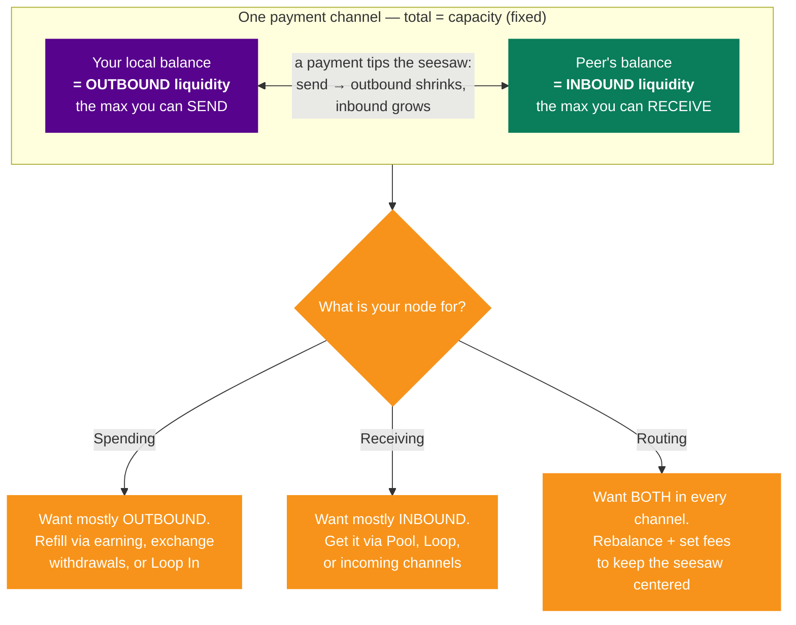

# How Lightning Liquidity Works: A Beginner's Guide to Moving Money on Lightning ⚡💧

By Delleon McGlone

Ask a new Lightning user what "liquidity" means and you'll usually get a shrug.
Ask someone who's run a node for a month and you'll get a sigh. Liquidity is the
single most important concept on the Lightning Network and also the one that trips
up almost everyone, because it behaves nothing like a bank balance. The same
satoshis can be liquid for you and illiquid for your peer at the same instant. In
this post, we'll build up an intuition for what Lightning liquidity actually is,
why it splits into two directions, and how node operators keep it flowing.

## The One-Sentence Definition

On the Lightning Network, **liquidity is the ability to move funds between
participants**. That's it. But because Lightning is built on payment channels
rather than a shared ledger, that ability is not a single number. It's split by
direction, locked into specific channels, and constantly shifting as payments
flow. Managing it well is what separates a node that "just works" from one that
mysteriously fails to send or receive.

The payoff for dealing with that complexity is real: value moves across Lightning
far more fluidly, cheaply, and instantly than on-chain or through legacy systems.
The trick is understanding the plumbing.

## Channels Are Buckets of Water on a Seesaw

A Lightning channel is a 2-of-2 arrangement between two peers with a fixed total
size, called its **capacity**. Picture that capacity as a fixed amount of water
sitting in a tube balanced on a pivot. Your side of the tube is your **local
balance**; your peer's side is their **remote balance**. The two always add up to
the capacity, so a payment doesn't create or destroy water, it just tips the
seesaw, moving balance from one side to the other.

This is why direction matters so much:

- Your local balance is your **outbound liquidity**: the maximum you can send
  through that channel.
- Your peer's balance is your **inbound liquidity**: the maximum you can receive
  through that channel.

Every satoshi you can send is a satoshi you can't receive, and vice versa. When
you make a payment, your outbound liquidity shrinks and your inbound liquidity
grows by the same amount. The seesaw tips. This single fact explains nearly every
liquidity headache on Lightning.

## Why New Nodes Can't Receive

Here's the classic beginner trap. You install a wallet, fund it, and open a
channel. All of that capacity starts on your side as local balance, because you
put the money in. That means you have plenty of outbound liquidity and **zero
inbound liquidity**. You can spend all day, but the moment someone tries to pay
you, the payment fails, there's no room on your peer's side of the seesaw to
receive it.

Getting inbound liquidity therefore requires someone else to commit capital
pointed at you. You can earn it by spending (which tips your channels back toward
inbound), you can have a peer open a channel to you, you can use
[Lightning Loop](https://lightning.engineering/loop/) to swap on-chain funds into
channel balance, or you can simply buy it on
[Lightning Pool](https://lightning.engineering/pool/), the non-custodial
marketplace where inbound liquidity is a tradeable asset. Different tools, same
goal: get water onto the other side of the tube.

Here's the whole picture in one diagram, a single channel and what each side means
for sending and receiving:

## Different Nodes, Different Liquidity Needs

Liquidity is deeply contextual, what counts as "good" depends entirely on what
your node is for.

**If you mainly spend**, liquidity is really about having your funds in
well-connected channels so payments reliably find a route. Fewer, larger channels
often beat many small ones, though concentrating everything in a single channel
means your money goes temporarily illiquid if that one peer drops offline. Since a
spending node isn't routing, its channels can be private (unannounced to the
network).

**If you mainly receive**, liquidity is essentially synonymous with inbound
capacity. You want channels with well-connected peers but your own balance kept
low, leaving maximum room to receive. That usually means incentivizing others to
point capital at you, most directly by buying inbound on Lightning Pool.

**If you route**, you need both directions in every channel. A channel that's all
outbound or all inbound can only route one way, so an ideal routing channel keeps
a healthy balance on each side, large enough to forward a reasonably sized payment
in either direction at any time.

## Keeping the Seesaw Centered: Rebalancing and Fees

For a routing node, the work never really stops, because every payment you forward
tips your channels. Route a big payment through one channel and it drains toward
one side, becoming useless for further forwarding in that direction until it's
topped back up.

Routing operators handle this with **rebalancing**: shifting balance between their
own channels, either manually or with automated tools, to keep capacity available
on both sides. Rebalancing isn't free, so operators set **routing fees** that make
the effort worthwhile, earning income from the payments they forward while
covering the cost of keeping channels ready. It's a constant balancing act between
deploying capital where the network demands it and getting paid enough to justify
committing it.

A subtle point that catches operators off guard: private channels look different
from each side. Satoshis a mobile wallet holds in a private channel to your
routing node are perfectly liquid for the wallet, it can come online and spend or
receive anytime. But from the routing node's perspective those same satoshis are
highly illiquid: you can't route through a private channel, and your only exits
are a cooperative close (when the peer next comes online) or a force close. Those
funds shouldn't be counted toward your sending or receiving capacity, even though
they can still earn you good routing fees when the peer transacts regularly.

## On-Chain Liquidity Is the Simple Cousin

It's worth remembering that on-chain bitcoin has its own, much simpler liquidity:
you can move it anytime for a fee that bids for space in the next block (roughly
every 10 minutes). The wrinkle is channel closures. A unilateral force close makes
the initiating party wait out a timelock, anywhere from a day to a few weeks, set
when the channel was opened, before they can spend their funds, while the other
side can spend immediately. Force closing is sometimes the only way to recover
funds from a channel whose peer has gone dark, which is exactly why keeping
channels healthy and peers online matters.

## The Takeaway

Lightning liquidity isn't a balance, it's a direction. Every channel is a seesaw
of fixed size, your local balance is what you can send, your peer's balance is
what you can receive, and every payment tips the board. New nodes can spend but
not receive because all their water starts on one side. Spenders, receivers, and
routers each want that water arranged differently, and tools like Loop and Pool
exist precisely to move it where it's needed without opening a brand-new channel
every time.

Once the seesaw clicks, the rest of the network starts to make sense. Get a feel
for it by running a node and watching your channel balances shift with real
payments, that intuition is worth more than any diagram. Here's to keeping the
money flowing. ₿🥂

---

_Primary source:_
[Understanding Liquidity](https://docs.lightning.engineering/the-lightning-network/liquidity/understanding-liquidity),
Lightning Labs documentation. Related tools:
[Lightning Pool](https://lightning.engineering/pool/) and
[Lightning Loop](https://lightning.engineering/loop/).

---

_Part of [Lightning Labs Prep](../README.md). Study notes behind this article:
[03 — Lightning Liquidity](../03-lightning-liquidity.md). Companion article:
[What Is a Lightning Pool?](./what-is-lightning-pool.md)._
