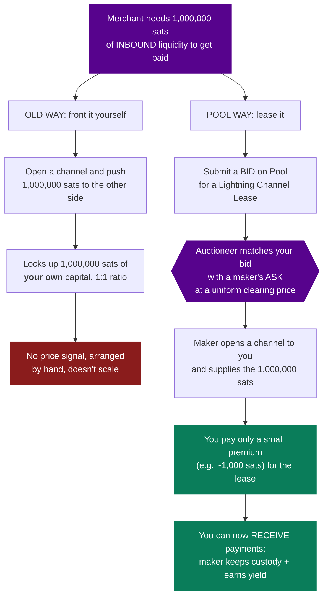

# How Pool Solves Inbound Liquidity: Turning a Scramble Into a Marketplace ⚡🏊💧

By Delleon McGlone

In two earlier posts we covered
[what Lightning Pool is](./what-is-lightning-pool.md) and
[how Lightning liquidity works](./how-lightning-liquidity-works.md). This post
connects them. We're going to zoom in on the single hardest problem in that
liquidity story, inbound liquidity, and walk through exactly how Pool turns it
from a manual scramble into a clean, priced market. If you've ever set up a node,
been unable to receive a payment, and wondered "how is anyone supposed to fix
this?", this one's for you.

## A Quick Refresher on the Problem

Lightning is fully collateralized. To receive up to N bitcoin over a channel, some
other peer must first commit at least N bitcoin into a channel pointed at you.
That capacity to receive is **inbound liquidity**, and for any brand-new node it
starts at exactly zero.

That's the trap. A merchant who wants to accept Lightning payments needs inbound
liquidity before the first customer can pay. A wallet user can't be paid until
someone opens a channel toward them. You can spend all day, but you can't receive
a single satoshi until capital is pointed your way. Inbound liquidity is the
resource, and it's genuinely scarce.

## The Old Way: A Scramble

Before Pool, acquiring inbound liquidity meant doing it by hand, and every method
had the same flaw. You could:

- Post on Twitter or in Telegram groups begging for channels.
- Arrange mutually balanced channel opens one peer at a time.
- Pay a one-off over-the-counter service to open capacity toward you.
- Spend your own outbound balance and hope enough tips back as inbound.
- Front the capital yourself, opening a channel and pushing the full balance to
  the other side.

These worked, sort of, but none of them scaled and none of them had a price. A
merchant fronting their own capital had to commit the entire amount they wanted to
receive, tying up, say, a full 1,000,000 satoshis to be able to receive 1,000,000
satoshis. There was no market signal telling anyone what inbound liquidity was
actually worth, and no reliable venue to buy it. The demand was obviously real,
the proof was that people kept inventing ad hoc workarounds, but the supply had
nowhere efficient to meet it.

## Pool's Core Idea: Package Inbound Liquidity as an Asset

Pool's insight is to treat inbound liquidity as a product that can be bought and
sold, rather than a favor to be arranged. It does this through the **Lightning
Channel Lease (LCL)**: a contract that packages up channel liquidity with a
maturity date measured in blocks and enforced by Bitcoin.

That reframing creates a genuine two-sided market:

- **Takers** need to receive, so they need inbound liquidity. They submit a **bid**
  to buy an LCL. These are merchants, exchanges, wallets, and services.
- **Makers** have idle capital to deploy. They submit an **ask** to lease out
  their outbound liquidity, opening a channel toward the taker and earning a yield.
  These are well-capitalized routing nodes and exchanges.

When a taker's bid matches a maker's ask, the maker opens a channel pointed at the
taker. That channel is the taker's new inbound liquidity, exactly the scarce
resource they couldn't get before, now delivered on demand.

## The Magic: Pay a Premium, Not the Principal

Here's the part that fixes the fronting problem. On Pool, the taker does not have
to commit the full amount of liquidity they want. The maker supplies the capital
and keeps control of it the whole time; the taker just pays a small premium for
the lease.

Concretely, a merchant might pay 1,000 satoshis to have 1,000,000 satoshis of
inbound capacity committed toward their node for the duration of the lease.
Instead of locking up a million sats of their own, they spend a thousand. For a
wallet provider onboarding thousands of users, that's the difference between
fronting capital at a 1:1 ratio and paying a tiny fraction, it collapses
customer-acquisition costs and makes bootstrapping inbound liquidity economically
sane for the first time.

Let's see the contrast directly:

## Why This Actually Solves It, Not Just Shifts It

It would be easy to dismiss this as moving the cost around, but Pool solves the
structural problems that made inbound liquidity so painful.

**It creates a price.** Every cleared auction batch reveals a per-block lease rate,
the Block Percentage Yield, the market's live answer to "what is inbound liquidity
worth right now?" That signal never existed before. Makers can finally tell where
their capital is demanded instead of guessing, and takers know what they should
expect to pay.

**It matches supply to demand at scale.** Instead of one merchant DMing one whale,
a deep two-sided marketplace continuously pairs everyone who needs to receive with
everyone who has capital to lease. The scramble becomes an order book.

**It keeps everyone in control of their money.** Pool is non-custodial. Funds sit
in 2-of-2 multi-sig accounts, the auctioneer can never move them, and cleared
orders settle in a single batched Bitcoin transaction (which also makes opening
the channel cheaper than doing it alone). The maker earns yield without ever
handing over custody; the taker gets real inbound capacity without trusting a
third party with funds.

**It turns idle capital into an incentive.** Because makers get paid to supply
inbound liquidity, there's now a reason for capital to flow to the nodes that need
to receive. Scarcity is met with a market-driven supply response instead of
charity.

## The Takeaway

Inbound liquidity was Lightning's original chicken-and-egg problem: you can't
receive until someone commits capital to you, and there was no good way to make
that happen. Pool solves it by packaging inbound liquidity into a tradeable
Lightning Channel Lease, letting takers pay a small premium instead of fronting
the full principal, and pricing the whole thing through a non-custodial auction.
The merchant who once couldn't accept a single payment can now buy the exact
inbound capacity they need, in one batch, for a fraction of the capital, while the
node that supplied it earns a yield and keeps its coins.

That's the arc of this little series: liquidity is the problem, direction is the
catch, and Pool is the market that makes inbound liquidity something you can simply
buy. Here's to never scrambling for a channel again. ₿🥂

---

_Primary sources:_
[Lightning Pool Is Open for Business](https://lightning.engineering/posts/2020-11-02-lightning-pool/)
and
[Lightning Pool: A Technical Deep-Dive](https://lightning.engineering/posts/2020-11-02-pool-deep-dive/)
by Olaoluwa Osuntokun, and
[Understanding Liquidity](https://docs.lightning.engineering/the-lightning-network/liquidity/understanding-liquidity),
Lightning Labs.

---

_Part of [Lightning Labs Prep](../README.md). The series:
[What Is a Lightning Pool?](./what-is-lightning-pool.md) ·
[How Lightning Liquidity Works](./how-lightning-liquidity-works.md) · this post.
Study notes behind it:
[04 — Pool: Auctions & Lease Pricing](../04-pool-auctions-lease-pricing.md) and
[05 — Pool: Observations from Running It Live](../05-pool-observations.md)._
